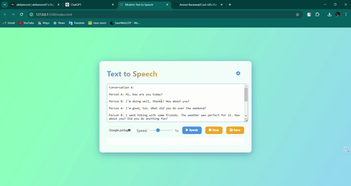

# 🎙️ Modern Text-to-Speech App

<p align="center">
  
</p>

<p align="center">
  
  <a href="https://github.com/alidiamond1/text-to-speech-app/blob/main/LICENSE">
    
  </a>
  <a href="https://twitter.com/@Alidiamond143">
    
  </a>
</p>

> A sleek, modern text-to-speech application that brings your words to life with style and efficiency.

<p align="center">
  
</p>

## ✨ Features

- 🗣️ Convert text to speech with customizable voices
- 🎚️ Adjust speech rate in real-time
- 💾 Save text to file for later use
- 🌓 Toggle between light and dark modes
- 📱 Responsive design for all devices
- 🎨 Modern UI with gradient backgrounds and frosted glass effect

## 🚀 Demo

Experience the app in action: [Live Demo](https://text-to-speech-app-seven.vercel.app/)

## 🛠️ Installation

1. Clone the repository:
   ```sh
   git clone https://github.com/alidiamond1/text-to-speech-app.git
   ```

2. Navigate to the project directory:
   ```sh
   cd text-to-speech-app
   ```

3. Open `index.html` in your web browser.

## 🖥️ Usage

1. 📝 Enter your text in the textarea.
2. 🎤 Choose a voice from the dropdown menu.
3. ⏩ Set your preferred speech rate.
4. ▶️ Hit "Speak" to hear your text.
5. ⏹️ Use "Stop" to halt speech.
6. 💾 Click "Save" to download your text.
7. 🌓 Toggle dark mode with the settings icon.

## 🔧 Technologies Used

- 
- 
- 
- Web Speech API

## 🤝 Contributing

Contributions, issues and feature requests are welcome!<br />Feel free to check [issues page](https://github.com/alidiamond1/text-to-speech-app/issues).

## 📝 License

Copyright © 2023 [Alidiamond](https://github.com/alidiamond1).<br />
This project is [MIT](https://github.com/alidiamond1/text-to-speech-app/blob/main/LICENSE) licensed.

## 👤 Author

**Alidiamond**

<!-- * Website: [yourwebsite.com](https://www.yourwebsite.com) -->
* Twitter: [@Alidiamond143](https://twitter.com/Alidiamond143)
* GitHub: [@alidiamond1](https://github.com/alidiamond1)
* LinkedIn: [@alidiamond](https://www.linkedin.com/alidiamond)

## 🌟 Show your support

Give a ⭐️ if this project helped you!

## 📊 Project Stats


---

<p align="center">Made with ❤️ by <a href="https://github.com/alidiamond1">Your Name</a></p>
